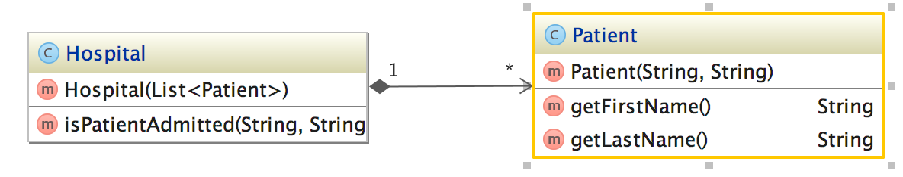
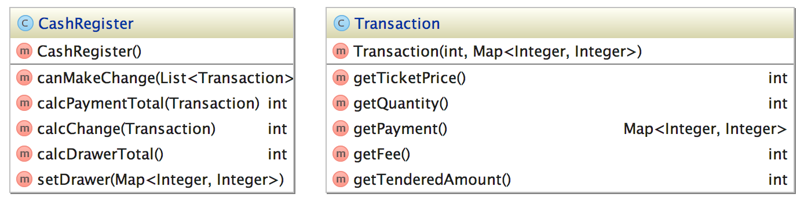

# Solving Accumulator Problems with Java

## Approach

As you progress through the list of problems below, pick a different pairing technique (Ping Pong Pairing, Pólya's method, Restricting techniques, etc. or create your own) for each problem.

For each problem, begin by first writing a failing test and then making it pass. Repeat this process until all required functionality for the problem has been implemented. At each passed test, make sure to ask yourself if what you have done is the _minimum_ required to make the test pass. Refactor the code if you see an opportunity to.

Although these are not production problems, treat them as if they are. Think through edge cases (if any exist) and make sure that at all steps you use tests to document your thoughts about what the code should do.

Work together with each other and communicate as you go. Sometimes communication with a pair can be "can we take five minutes to solve this on paper apart from each other and then re-group?" Effective communication does not necessitate non-stop talking, but it does necessitate communicating what you are thinking about the problem at hand.

## Problems

### Problem 1: `List<Integer>`
Create a class called `NumberListUtil` with a `findMissingNumbers()` method that accepts two `List<>`s of `Integers`, and returns a `List<Integer>` containing numbers not present in the second `List<>`. For example `[1,2,3,4,5]` and `[2,3,1,0,5]` returns `[4]`. ([source](http://javarevisited.blogspot.com/2011/06/top-programming-interview-questions.html))
  
### Problem 2: Counting Characters  
Create a class and add a static method which, when given two Strings, produces a `Map<>` with the count of characters in both strings. Call the class and method whatever you like. For example, the `charCount("ab", "b");` method would produce `{a: 1, b: 2}`.

### Problem 3: Patient Registry 
Write code for a `Hospital`, which accepts a `List<Patient>`, each of whom have a `firstName` and `lastName` property, on construction. The hospital should be able to tell if a patient is in the hospital by checking against their first and last name.



### Problem 4: Making Change
[stretch] Can you create code that mimics the interactions of a `CashRegister` (till)? Suppose you are the cashier of a sports venue. All tickets for admission are `$15`. You accept cash currency for `$1`, `$5`, `$10`, `$20`, `$50`, `$100` and start the day with an initial drawer of cash, as follows:

```
private SortedMap<Integer, Integer> drawer = new TreeMap<Integer, Integer>() {
    {
        put(1, 20);
        put(5, 5);
        put(10, 5);
        put(20, 5);
        put(50, 5);
        put(100, 2);
    }
};
```
 
Your goal is to write a function for modeling the `CashRegister`. Instances of `CashRegister` should have a method named `canMakeChange()` which accepts a `List<>` of `Transaction` objects and returns `true` if the transactions can be completed and `false` if not.



### Problem 5: Primes 
[stretch] `2520` is the smallest number that can be divided by each of the numbers from `1` to `10` without any remainder. What is the smallest positive number that is evenly divisible by all of the numbers from `1` to `20`? Can you write a function that returns the smallest number that can be divided by each of the numbers from `1` to `n` without any remainder? (adapted from [this problem](https://projecteuler.net/problem=5)).

### Test Setup

* General setup for an application with tests:
  1. `mkdir app_name`
  1. `cd app_name`
  1. `gradle init --type java-library`
  1. Import into IntelliJ
    1. File
    1. New Project From Existing Sources
    1. Select folder
    1. Import project from external model
    1. Gradle
    1. Use Auto Import
    1. Create Directories for existing sources automatically
    1. Finish

It is recommended to make a test per problem, or figure out a similar organization strategy that works for you and your pair.

You can use IntelliJ to run your tests, or you can run them from the command line:

```
gradle test
```

### Automated assessment

An automated assessment has been provided for this assignment. To verify your work, you should run the assess command:

```
gradle assess
```

Make sure to do this as you complete each problem.

## Reflection

Stop coding approximately 15 minutes before the end of the exercise and have a discussion with your pair. There are a few different ways to do this. One way to facilitate the discussion is to start by taking 3-5 minutes to each create a list of thing you did:

  1. well
  1. poorly
  1. somewhere in between

Some questions to help frame this could include:

  1. At what points were we delivering?
  1. What was happening during times where code was being delivered?
  1. At what points were we not delivering?
  1. What was causing us to not deliver?
  1. When were defects introduced and what introduced them?
  1. Did we write tests before code at all points in time?
  1. Did we communicate openly and effectively?
  1. Were we able to create a positive social environment that promotes experimentation and education?
  1. Did one member of the pair dominate the session?
  1. Was there a specific pairing technique that was effective?

Combine both lists and review all items. As you are reviewing the items ask yourself:

  1. If it is a problem, is there an easy solution to this problem? What causes this problem? How can the causes of this problem be eliminated?
  1. Moving forward would you do this again? _Should_ you?
  1. What did I learn from this? What is a reasonable takeaway from this?

## git Instructions

Begin by forking the repository from which you'll be working. The 'Fork' button is located in the upper right-hand corner of the repository's Github page. Once complete, you'll arrive at your Forked repository's Github page. There you'll find the link to the git repository by clicking the 'Clone or Download' button.

To set up your repository in git using HTTPS:

	git clone https://github.com/gSchool/java-drills.git

Or by using SSH:

	git clone git@github.com:gSchool/java-drills.git

Once you have cloned the repository, run the following command to verify the repository was successfully cloned:

	git config -l

In the output verify that the following line exists:

	remote.origin.url=git@github.com:gSchool/java-drills.git


