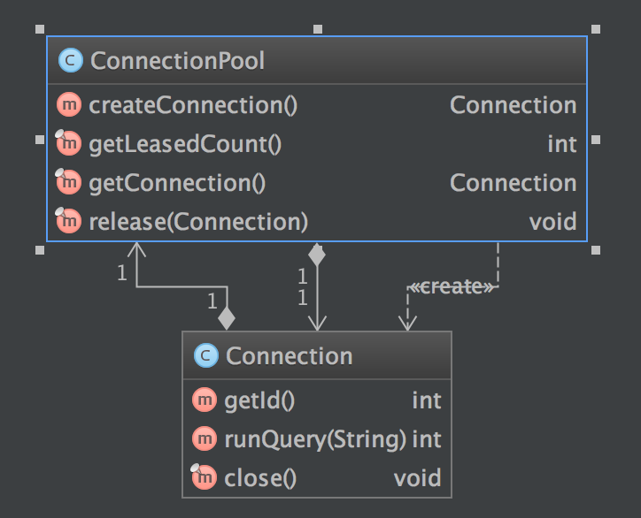

# Building a Bulletproof API with Access Modifiers

## Background

So far we have learned about packages, scope, and access modifiers, now it is time to see how they are used in real life. These really become necessary when you build an API that others will consume. When building APIs, it is important to make sure that the consumer can only call the exposed methods, and not mess with the internal implementation details or else the functionality of the API may be compromised. An important example of this is a connection pool, which we will build today. 
  
We will be learning about SQL shortly, but for now only the most basic understanding is necessary. Applications can talk to databases, and they do this using a database _connection_. Usually, setting up a connection is a very expensive operation, so database drivers will allocate a _pool_ of preallocated connections from which the driver will _lease_ connections to the application. What is very important is that no-matter-what, the application always returns the connection back to the pool, otherwise you have what is called a _leak_.

Fortunately, Java provides us with the [try-with-resources](https://docs.oracle.com/javase/tutorial/essential/exceptions/tryResourceClose.html) statement and the [AutoClosable interface](https://docs.oracle.com/javase/8/docs/api/java/lang/AutoCloseable.html).

Our goal for this assessment is to use these Java constructs to ensure the following code will always return the `Connection` to the `ConnectionPool`:

```java
ConnectionPool pool = new ConnectionPool(5);
try(Connection connection = pool.getConnection()) {
    throw new RuntimeException("Kaboom!");
}
```

*** note: the `Connection` must be returned to the `ConnectionPool` even when the exception is thrown! ***

In order to ensure the integrity of our pool, we must make sure that even the most malicious of consumers cannot spoil the integrity of our pool:

- `Connection`s always should be returned to the pool when allocated in a try-with-resources block
- Consumers should not be able to create `Connection` objects except by leasing them from the `ConnectionPool`
- `Connection.close()` should return the `Connection` to the `ConnectionPool` (not actually close it)
- Consumers should only be able to return the `Connection` to the pool by calling `Connection.close()` (not by calling any method on the pool directly)

Use your knowledge of packages, scope, and access modifiers to make the most secure connection pool you can!

### Class Diagram

In order to fulfill the assessment, you will need to create your classes and name your methods as they appear in this diagram:



### Stretch

- Use your knowledge of scope to create a guaranteed unique auto-incrementing ID for each `Connection`
- Subclass `ConnectionPool` to return your own `SpecialConnection` that has custom behavior, but still relies on the super class' secure leasing.
- Track both _available_ and _leased_ connections, and store a [stack trace](http://stackoverflow.com/questions/1069066/get-current-stack-trace-in-java) of each method with an outstanding lease
- Start a [Timer](https://docs.oracle.com/javase/7/docs/api/java/util/Timer.html) when a connection is leased, and if the lease is active for more than 1 second, log a warning with the stack trace of the offending caller
- Make sure the whole API is thread-safe, and write a multi-threaded, randomized delay [fuzz-tester](http://techblog.netflix.com/2012/07/chaos-monkey-released-into-wild.html)
 
### Test Setup

You can use IntelliJ to run your tests, or you can run them from the command line:

```
gradle test
```

### Automated assessment

An automated assessment has been provided for this assignment. To verify your work, you should run the assess command:

```
gradle assess
```

Make sure to do this as you complete each problem.

## Reflection


## git Instructions

Begin by forking the repository from which you'll be working. The 'Fork' button is located in the upper right-hand corner of the repository's Github page. Once complete, you'll arrive at your Forked repository's Github page. There you'll find the link to the git repository by clicking the 'Clone or Download' button.

To set up your repository in git using HTTPS:

	git clone https://github.com/<your name>/java-drills.git

Or by using SSH:

	git clone git@github.com:<your name>/java-drills.git

Once you have cloned the repository, run the following command to verify the repository was successfully cloned:

	git config -l

In the output verify that the following line exists:

	remote.origin.url=git@github.com:<your name>/java-drills.git

Finally, create a branch in which you will do your work:

    git checkout -b solution

After you have completed the assessment, be sure to push your changes:

    git add .
    git commit -m "Completed Assessment"
    git push origin solution

